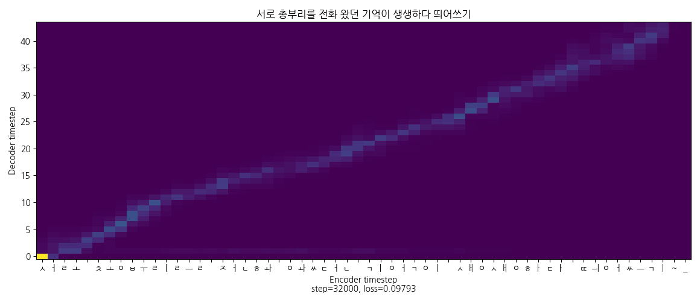
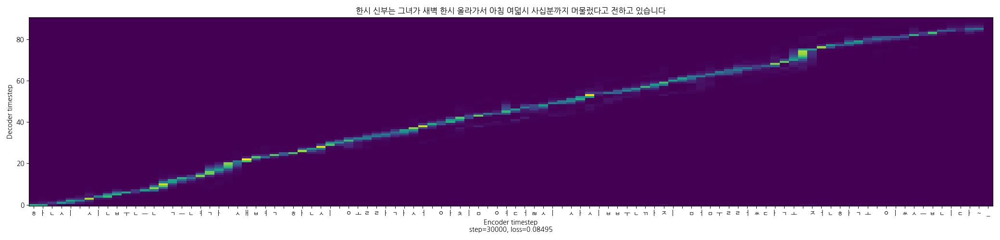
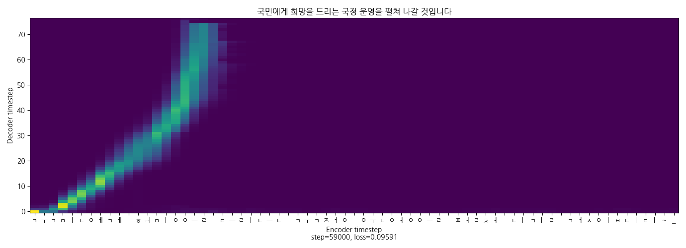
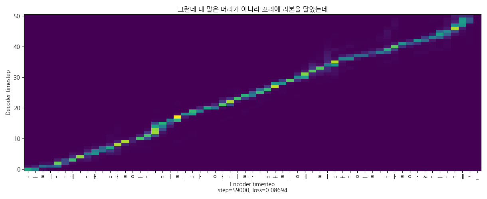
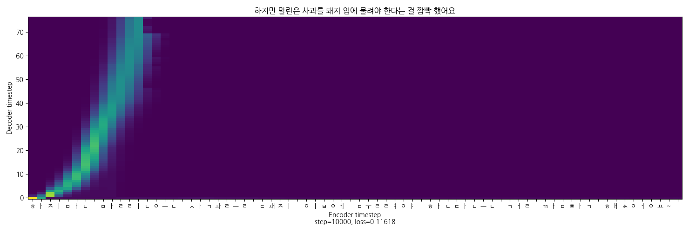
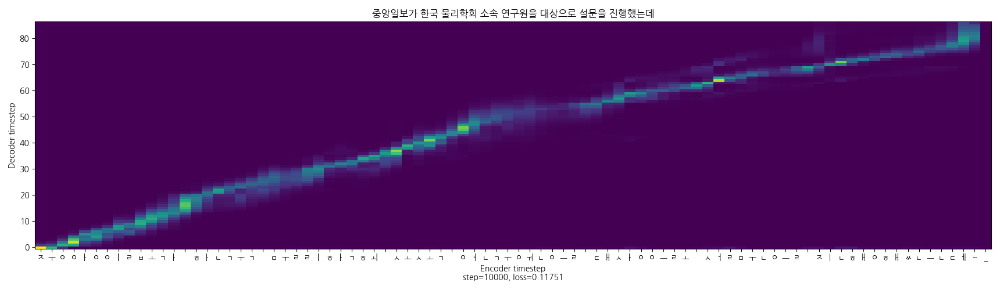

# Reading_book_app

### 0. 참고자료
- [코드](https://github.com/GSByeon/multi-speaker-tacotron-tensorflow)
- [에러 발생시](https://github.com/carpedm20/multi-speaker-tacotron-tensorflow/issues)
- [FFMPEG](https://blog.naver.com/chandong83/222095346417)

### 1. 학습 데이터셋
- 손석희, [kss](https://www.kaggle.com/bryanpark/korean-single-speaker-speech-dataset), [하니](https://audioclip.naver.com/audiobooks/901DFE68BC), (박근혜), (이말년)
  - [손석희](https://github.com/GSByeon/multi-speaker-tacotron-tensorflow): 음성인식까지 진행하고, recognition.json을 정제하여 alignment.json으로 활용하였습니다.
  - kss: 기본적으로 오디오와 텍스트 모두 제공됩니다.
  - 하니: 오디오를 녹음하고 [etri api](https://aiopen.etri.re.kr/guide_recognition.php)를 활용하여 텍스트를 추출하였습니다.
- 박근혜, 이말년 데이터셋은 손석희 데이터셋과 수집 방법이 거의 동일합니다.
  - 링크 리스트 → 영상 다운로드 → wav로 변환하기 → 음성인식 → alignment.json 구성하기
  
  
### 2. 데이터 전처리
- 모델의 성능을 결정짓는 가장 중요한 절차입니다.
- 오디오에 대한 전처리는 공백 기준 분할하기 → 공백 제거 → 음량 정규화 순서로 진행하였습니다.
- 텍스트에 대한 전처리는 하니, 박근혜, 이말년 데이터는 하나하나 수정작업을 하였지만, 손석희 데이터는 음성인식 결과 한글만 있는 데이터를 위주로 활용하였습니다.
  - 손석희 데이터에서 영어는 jtbc → 제이티비씨, 숫자는 1 2 3 → 하나 둘 셋과 같은 식으로 변환해주었지만, 숫자와 한글이 일대일대응이 아니기에 주의가 필요합니다.

### 3. 결과 비교
- 싱글 vs 멀티
  - 화자에 따라 말하는 스타일은 다르긴 하지만, 한국어의 공통적인 요소를 학습하게 되는 멀티 모델이 싱글보다 학습이 안정적으로 되어 어텐션이 잘 잡힌다.

- 많은 화자 vs 정제된 화자
  - 오히려 화자가 3명일 때의 어텐션이 더 잘 잡히는 것을 볼 수 있다. 이는 이말년 데이터가 다른 데이터와는 달리 불규칙적인 발화 스타일을 가지고 있어서 노이즈로 작용한 것으로 분석된다.

- reduction factor: 4 vs 5
  - [선행 연구](https://www.eksss.org/archive/view_article?pid=pss-10-1-39)에 따르면 5일 때 문장에 따른 기복이 4보다 크다고 하였다. 하지만 학습시킨 결과 5가 더 좋았다.

### 4. 데모
- demo.ipynb 파일을 통해 손석희/kss/하니의 목소리로 124k까지 학습시킨 모델로 음성합성하실 수 있습니다.
  - 이에 앞서 드라이브에 tacotron 디렉토리에 git clone을 먼저 하셔야 합니다.
  

- [발표영상](https://www.youtube.com/watch?v=03clOvhhbF8&ab_channel=YBIGTA)
